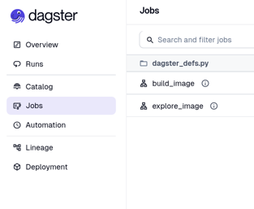
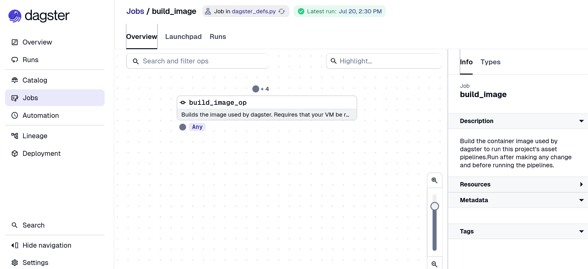
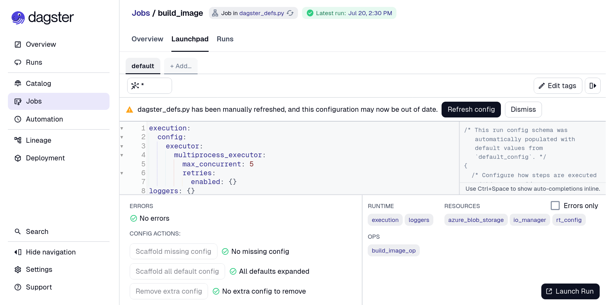
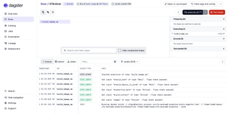
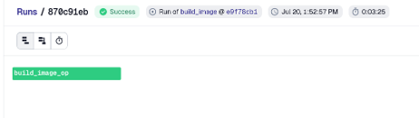

# Tutorial on Creating a Job to Build and Push Image to ACR

First, we will add code to `dagster_defs.py` that will create an [op](../getting-started/concepts.md#Ops) to be called by a [job](https://docs.dagster.io/guides/build/jobs). The `op` tells the `job` to build the image, login to ACR, and push the image to ACR. Add the following code to your `dagster_defs.py` file:
```
if not is_production():
    # Build and Push Image ---------------------------

    @dg.op
    def build_image_op(
        context: dg.OpExecutionContext,
        should_push: bool,
        should_deploy_to_prod: bool,
        dockerfile_path: str,
        build_context: str,
        image: str,
    ):
        """
        Builds the image used by dagster. Requires that your VM be registered with an Azure managed identity.

        should_push: bool - should the image be pushed to the Container Registry?
        should_deploy_to_prod: bool - should the prod server be updated with the newest image? (usually you do not want to do this)
        dockerfile_path: str - where is the Dockerfile located locally? (has a default)
        build_context: str - where should we build from? (has a default)
        image: str - the full name (including registry and tag) of the image
        """

        build_command = [
            "docker",
            "build",
            "-t",
            image,
            "-f",
            dockerfile_path,
            build_context,
        ]

        if should_push:
            subprocess.run(
                ["az", "login", "--identity"],
                check=True,
            )
            subprocess.run(["az", "acr", "login", "-n", IMAGE_REGISTRY], check=True)
            build_command.append("--push")
        context.log.info(f"Running {' '.join(build_command)}")
        subprocess.run(build_command, check=True)

        update_script_url = (
            # repo
            "https://raw.githubusercontent.com/CDCgov/cfa-dagster/"
            # ref
            "refs/heads/main/"
            # file
            "scripts/update_code_location.py"
        )

        if should_deploy_to_prod:
            context.log.info(f"Deploying {image} to the dagster prod server.")
            subprocess.run(
                ["uv", "run", update_script_url, "--registry_image", image], check=True
            )

    @dg.job(
        description=(
            "Build the container image used by dagster to run this project's asset pipelines."
            "Run after making any change and before running the pipelines."
        ),
        config=dg.RunConfig(
            ops={
                "build_image_op": {
                    "inputs": {
                        "should_push": True,
                        "should_deploy_to_prod": False,
                        "dockerfile_path": f"{local_workdir}/Dockerfile",
                        # the build context should be the top level of the repo
                        "build_context": str(local_workdir),
                        "image": image,
                    }
                }
            },
            # configure this job to run on your computer
            execution=basic_execution_config.to_run_config(),
        ),
        executor_def=dynamic_executor(),
    )
    def build_image():
        build_image_op()
```

If you would like to be able to explore the filesystem within the container you just built in the previous step, you can add the following *optional* code, which creates a job to be able to interactively navigate the filesystem:
```
@dg.op
    def explore_image_op(
        context: dg.OpExecutionContext,
    ):
        """
        Allows you to run the container you previously built and explore the filesystem that will be used by dagster.
        """
        context.log.info(
            "Check the terminal from which you ran the webserver to interact; stdout from your terminal will appear below."
        )
        explore_cmd = (
            ["docker", "run", "-it"]
            + [
                item
                for mount in blob_mounts
                for item in ("-v", local_mounting_dir + mount)
            ]
            + ["--rm", image, "bash"]
        )
        subprocess.run(explore_cmd, check=True)

    @dg.job(
        description=(
            "Interactively navigate the filesystem of your last-built container, "
            "as it would be used in Docker or Azure Batch execution."
        ),
        executor_def=dg.in_process_executor,
    )
    def explore_image():
        explore_image_op()
```
Then, *before* you materialize your Dagster assets, make sure to run the job.

To run the job, navigate to the “Jobs” page on the side panel. You should see your jobs when you click on this page.


 
Then, click on the job you would like to run. In this example, click on `build_image` and it will take you to an overview of the job.


 
Click on the Launchpad tab, which is next to the Overview tab above the `build_image_op` box. When you click on the Launchpad tab, it will open a page that looks like this:


 
Note: Any time you modify a configuration, click on the “Refresh config” button above the code box. Dagster will tell you if your configuration file needs to be refreshed. 

When you are ready to run your job, click on the “Launch Run” button on the bottom right-hand corner of the screen. While your job is running, you can see the logs printed out in real time at the bottom of the screen.


 
If the run is successful, you will see a “Success” message in green at the top of the screen.



Now, continue with running your workflow through [Azure](azure.md) or [Docker](docker.md). 
