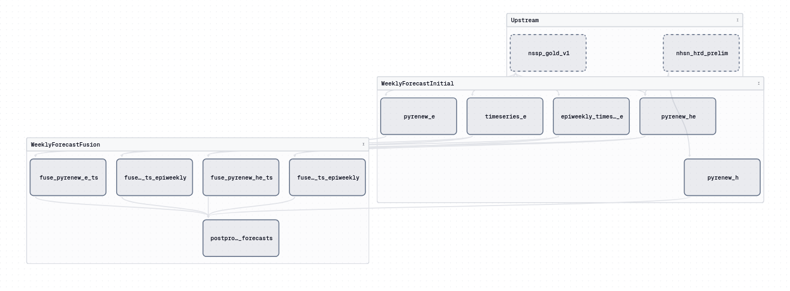

# CFA STF Routine Forecasting

The CFA STF Routine Forecasting project produces short-term forecasts for RSV, COVID-19, and influenza using three different models. Click [here](https://github.com/CDCgov/cfa-stf-routine-forecasting/tree/main) to go to the GitHub repository.

## Dagster implementation

### Why Dagster

* This workflow requires data to be read into the models, three different models to be run for three different respiratory diseases, and post-processing the results.
* The workflow is triggered to run when there is new data.
* The workflow will stop when upstream assets do not materialize successfully, but will continue for those that do materialize successfully.

### Dagster details

* Uses Azure blob storage mounting or blobs can be mounted locally with Docker.
* Daily partitions allow for the process to pull the most recent daily data rather than all of the data available.
* Implements a configurable resource, which allows for models to share configurations without having to set the same configuration multiple times.
* Assets are grouped into upstream data retrieval, initial modeling estimates, and post-processing results.
